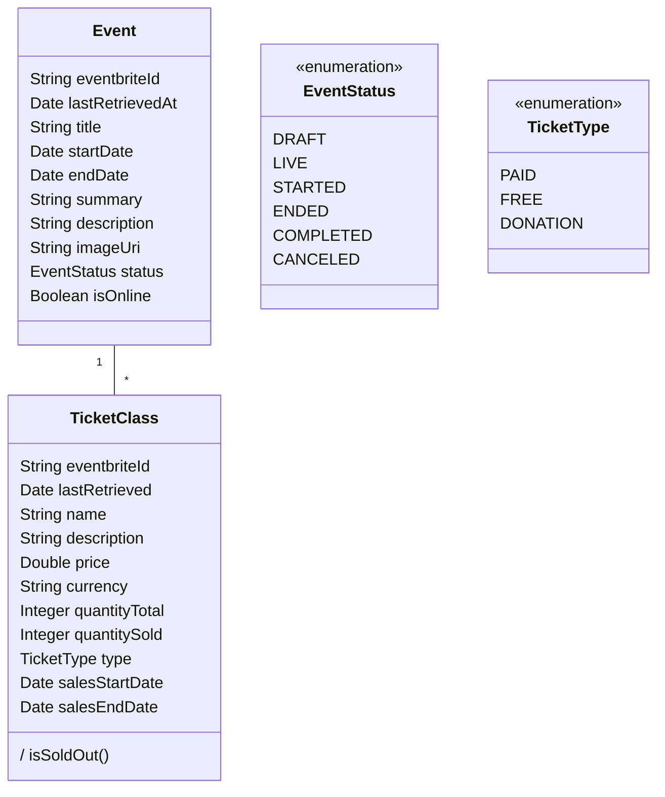

# Eventapp

*Eventapp* is a simple events web application. The _backend_ was built with [Node.js](https://nodejs.org/en/about/) using [Sequelize](https://sequelize.org/docs/v6/) and the [Express.js framework](https://expressjs.com/). The _frontend_ was built using the [React Native](https://reactnative.dev/docs/getting-started) framework. The application also connects to the [Eventbrite API](https://www.eventbrite.com/platform/api). 

The main goal of the app is to **list events in San Francisco, USA**.

Events are created previously at [Eventbrite](https://www.eventbrite.com/), then their corresponding IDs are stored. The events' information, including its tickets, is then retrived through the Eventbrite API and stored on a database. After that, all of this is presented to the user from the app *frontend*.

## Deployment

For further details, please check the [docs/Deployment.md](docs/Deployment.md) file.

First, we need a MariaDB server running. An easy way of deploying one is using docker:

```shell
docker run --detach --name eventapp_db \
    -p 3306:3306 \
    -e ALLOW_EMPTY_PASSWORD=yes \
    -e MARIADB_USER=eventapp_user \
    -e MARIADB_PASSWORD=eventapp_user \
    -e MARIADB_DATABASE=eventapp \
  bitnami/mariadb:10.7
```

Second, we need to deploy the Node.js application:

```shell
cd ./backend
npm install
cp .env.example .env
npm start
```

The default `.env.example` has the following values:

```
DATABASE_HOST=localhost
DATABASE_PORT=3306
DATABASE_USERNAME=eventapp_user
DATABASE_PASSWORD=eventapp_user
DATABASE_NAME=eventapp
APP_PORT=3000
EVENTBRITE_API_KEY=eventbrite_api_private_token
```

We need to provide our own `eventbrite_api_private_token` that we can obtain with an [Eventbrite](https://www.eventbrite.com/platform/api#/introduction) account.

We need to execute the migrations to create the database schema and seeders to fill it with some data.

```shell
npx sequelize-cli db:migrate:undo:all # Optional: Restores database

npx sequelize-cli db:migrate
npx sequelize-cli db:seed:all
```

## Overview

To check the application is properly running, we can send a request to the base url of the application:

```
http://localhost:3000/eventbrite/
```

We should see the following response:

```html
Eventapp API. Check <a href="https://github.com/carloscabello/eventapp">Repository</a>
```

To **fetch the event's information from the Eventbrite API and store it in the database**, there is an available endpoint:

```
[GET] http://localhost:3000/eventbrite/fetchall
```

The relevant endpoints from the Eventbrite API are documented at [docs/EventbriteAPI.md](docs/EventbriteAPI.md).

### Requirements

#### FR1: Event listing

Unauthenticated users will be able to list of *Events* in San Francisco ordered by date.

#### FR2: Event filtering

Unauthenticated users will be able to filter *Events*, specifying if the want to include *physical* or *online* events. These should be implemented as two separate filters.

#### FR3: Event details

Unauthenticated users will be able to display information from an individual *Event* in a separate page. It should include a button to a *Tickets* page. It should include the following information:

* Image/Background
* Title
* Description
* Date

#### FR4: Tickets listing

Unauthenticated users will be able to list of *Tickets* associated to an event, show only free and paid tickets. with the following information:

* Name
* Price and currency (sorted descending)
* Description
* Ticket Status: Available or Sold Out

### Proposed architecture

The following general architecture is proposed:

1. **Client-server architecture**.
2. **Frontend** and **backend** independent developments.

#### Backend

1. **Mariadb** server is used as for the relational database server.
2. **Sequelize** is used as the object–relational mapping tool
3. **Node.js** application that exposes a RESTful API implemented in the **Express.js** framework.

#### Frontend

**React-native** based client to display interact with the application.

### Class diagram



#### Sample events

These events' IDs are included in the `backend/seeders/202206071228-events-seder.js` to initialize the database with some events. No additional information is initialized so it can be retrieved through the Evenbrite API.

| Event name                   | Evenbrite ID |
| ---------------------------- | ------------ |
| Software Engineers' Gymkhana | 358418879517 |
| Eventapp Hackathon           | 358734282897 |
| 0 A.D. game tournament       | 358823900947 |
| Full-stack workshop          | 358819748527 |
| Single ticket Event          | 358751544527 |
| Round table discussion       | 358830420447 |
| Online Language Exchange     | 362885629687 |
| Online Minetest hangout      | 362889611597 |

There's also some additional events that are no included in the seeders so we can test fetching and storing events from scratch.

| Event name                             | Evenbrite ID |
| -------------------------------------- | ------------ |
| Experimental Music Festival            | 362884135217 |
| Online Language Exchange (2nd Edition) | 362888387937 |
